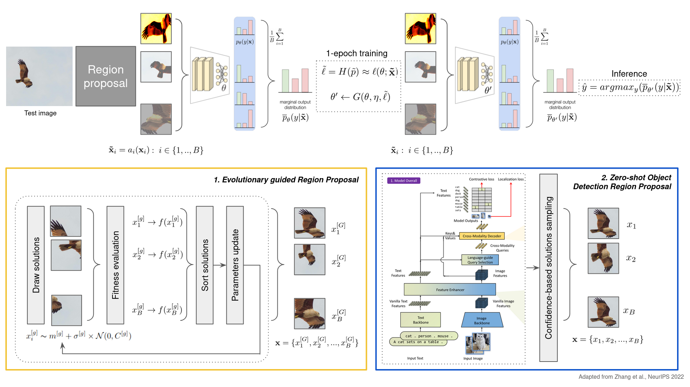

# Test Time Adaptation through externally guided Region Proposal

*Image adapted from:  Zhang et al., NeurIPS, 2022;  Liu et al., 2023*

**Project implementation and report:** [TTA_region_proposal.ipynb](https://github.com/gzemo/TTA-region-proposal/blob/main/TTA_region_proposal.ipynb) 

---

### Overview
Test Time Adaptation (TTA) is considered to be an out-of-the-box self-supervised procedure. It is expected to enhance Deep Learning model's predictive capability by means of exploitable test set features via an online learning stage by optimizing a pretext task. The purpose of this procedure is to better address the expected test set domain shift by increasing the prediction confidence by "episodic" model parameters update.
To tackle the domain shift problem in the context of image classification two independent Region Proposal (RP) modules had been developed in order to improve the final prediction. A guided search over portions of interest of a given image at test time is provided by means of:
1. an external, intra-image optimization task via **Covariance Matrix Adaptation, Evolutionary Strategy (CMA-ES)**,
2. a confidence-based region sampling via a prompt based **Zero-shot object detection model (gDINO)**.

This allows us to include the most insightful areas and to further exclude irrelevant portions that may hinder target objects classification.

### Results over Imagenet-A

| backbone | baseline | MEMO TTA, batch=16 | Evo  model-based, batch=16 |Evo  emap-based kernel size = 3, batch=16 | Evo  emap-based kernel size = 11, batch=16 |  Evo  freqmap-based kernel size = 3, batch=16 | Evo  freqmap-based kernel size = 11, batch=16 | gDINO box_thr=0.2, text_thr=0.2,  confidence=1, batch=16 | gDINO box_thr=0.2, text_thr=0.2,  confidence=1, batch=32 |
|----------|----------|----------|---------|--------|-------|--------|---------|--------|-------|
| resnet   | 99.1     | 98.6     | 98.8 (+0.2)    | 99.2 (+0.6) |  99.2 (+0.6)  |  99.2 (+0.6)   | 99.4 (+0.8)  | **98.4** (**-0.2**) | **98.3** (**-0.3**) |
| rvt*-small | 94.7   | 90.6     | 92.3 (+1.7)    |92.4 (+1.8)  |  92.9 (+2.3) |  92.9 (+2.3)   | 93.2 (+2.6)    | **85.7** (**-4.9**) | **85.4** (**-5.2**) |

---

### References

Bai, J., Yuan, L., Xia, S. T., Yan, S., Li, Z., & Liu, W. (2022, October). Improving vision transformers by revisiting high-frequency components. In European Conference on Computer Vision (pp. 1-18). Cham: Springer Nature Switzerland.

Bartz‐Beielstein, T., Branke, J., Mehnen, J., & Mersmann, O. (2014). Evolutionary algorithms. Wiley Interdisciplinary Reviews: Data Mining and Knowledge Discovery, 4(3), 178-195.

Cubuk, E. D., Zoph, B., Mane, D., Vasudevan, V., & Le, Q. V. (1805). Autoaugment: Learning augmentation policies from data. arXiv 2018. arXiv preprint arXiv:1805.09501, 2.

Liang, J., Cao, J., Sun, G., Zhang, K., Van Gool, L., & Timofte, R. (2021). Swinir: Image restoration using swin transformer. In Proceedings of the IEEE/CVF international conference on computer vision (pp. 1833-1844).

Liu, S., Zeng, Z., Ren, T., Li, F., Zhang, H., Yang, J., & Zhang, L. (2023). Grounding dino: Marrying dino with grounded pre-training for open-set object detection. arXiv preprint arXiv:2303.05499.

Nomura, M., & Shibata, M. (2024). Cmaes: A simple yet practical Python library for CMA-ES. arXiv preprint arXiv:2402.01373.

Zhang, M., Levine, S., & Finn, C. (2022). Memo: Test time robustness via adaptation and augmentation. Advances in neural information processing systems, 35, 38629-38642.

